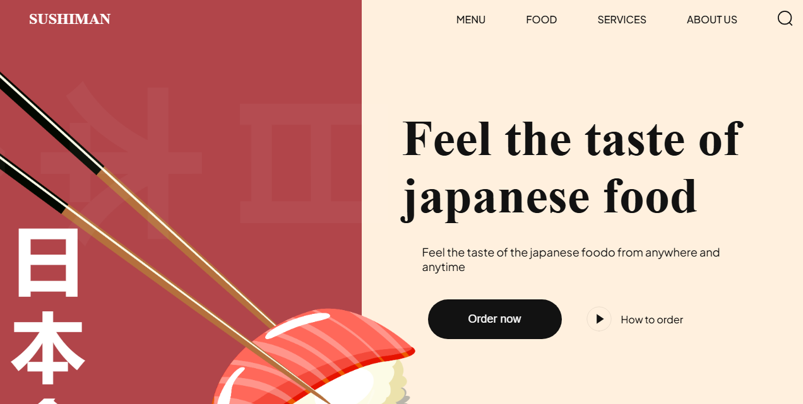

## 📋 Table of Contents

1. 🤖 [Introduction](#introduction)  
2. ⚙️ [Tech Stack](#tech-stack)  
3. 🔋 [Features](#features)  
4. 🤸 [Quick Start](#quick-start)  
5. 🕸️ [Snippets](#snippets)  
6. 🔗 [Links](#links)  
7. 🚀 [More](#more)  

## 🤖 Introduction

This project is a simple sushi-themed website built using HTML, CSS, and Vite. It showcases sections such as popular food, trending sushi, drinks, and more—all with clean, modern styling and subtle animations.

The goal is to help beginners explore web development concepts like layout structuring, styling methodologies, and responsive design techniques.

## ⚙️ Tech Stack

- HTML5  
- CSS3  
- Vite  

## 🔋 Features

- **CSS Variables** for consistent, easily maintainable styling  
- **Modular CSS Imports** to promote organized code  
- **Flex and Positioning** to create responsive layouts  
- **JavaScript Rendering** to build HTML content dynamically  
- **Smooth Animations** for a modern user experience  
- **BEM Methodology** for maintainable CSS class naming  
- **Well-Structured File Organization** for easy navigation  
- **Fully Responsive Design** that adapts to all screen sizes  

The project includes:

- Navigation Bar  
- Creative Hero Section  
- About Us Section  
- Popular Food, Trending Sushi, and Drinks Sections  
- Newsletter Signup  
- Footer  

## 🤸 Quick Start

Follow these steps to run the project locally:

### Prerequisites

Make sure the following are installed on your machine:

- [Git](https://git-scm.com/)  
- [Node.js](https://nodejs.org/en)  
- [npm](https://www.npmjs.com/)  

### Clone the Repository

```bash
git clone https://github.com/abdulrahmanbaiasy/sushiapp.git
cd sushiapp
```

### Install Dependencies

```bash
npm install
```

### Start Development Server

```bash
npm run dev
```

Open [http://localhost:5173](http://localhost:5173) in your browser to view the project.

